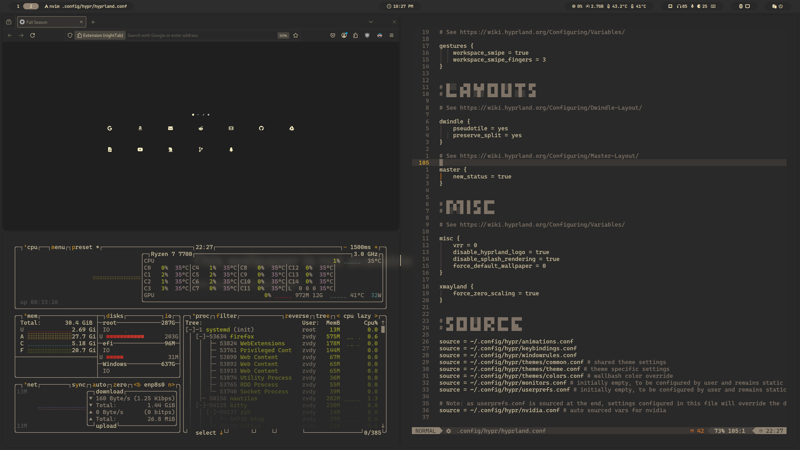

# Gruvbox Arch Linux Hyprland Dotfiles

This repository contains my [arch linux](https://archlinux.org/) gruvbox themed setup and software I useon a daily basis, It aims to be a simple minimal eye appealing workflow and environment.

# General

## Workflow

### Code editor
As Code editor, I use [neovim](https://github.com/neovim/neovim) with [lazyvim](https://www.lazyvim.org/) 

The configuration for lazy is under [/config/nvim/lua/config/lazy.lua](/config/nvim/lua/config/lazy.lua) and it udilizes the gruvbox theme developed from [morhetz](https://github.com/morhetz/gruvbox).

### Window manager 

As a workflow window manager I use [tmux](https://github.com/tmux/tmux/wiki) with [tpm(Tmux Plugin Manager)](https://github.com/tmux-plugins/tpm) to install add-ons, such as the gruvbox theme which was developed by [egel](https://github.com/egel/tmux-gruvbox).

## Browser
The main browser I use is [firefox](https://www.mozilla.org/en-US/). with the [Gruvbox by rgnx theme](https://addons.mozilla.org/en-US/firefox/addon/gruvboxtheme/?utm_source=addons.mozilla.org&utm_medium=referral&utm_content=search)

For the home page, i use the open source [night tab extension](https://github.com/zombieFox/nightTab).